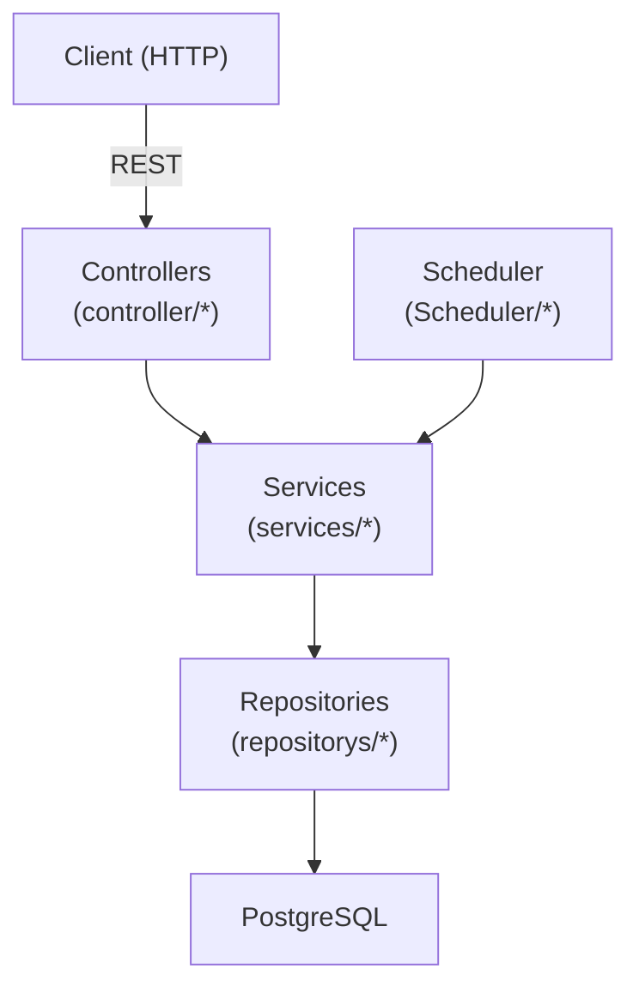

# back-ativos — Arquitetura 🏗️

## Visão Geral
Aplicação backend em **Spring Boot** (Java, Maven) para gerenciar ativos (máquinas, roteadores e extensões). Projeto segue padrão em camadas: Controller → Service → Repository → Database. Possui um agendador para verificar status das máquinas (ping).

---

## Componentes principais
- **API (REST)** — `controller/*` (ex.: `ControllerMachines.java`) expõe endpoints HTTP.
- **Serviços** — `services/*` (ex.: `ServiceMachines.java`) contém lógica de negócio e tarefas agendadas.
- **Repos** — `repositorys/*` (ex.: `MachinesRepo.java`) interfaces JPA para persistência.
- **Models/DTOs** — `models/*`, `dtos/*` definem entidades e objetos de transferência.
- **Config** — `config/*`, `application.properties` com datasource e ajustes.
- **Scheduler** — `Scheduler/SchedulerConfig.java` (tarefa periódica de ping).

---

## Fluxo de dados (resumido)
Client → Controller → Service → Repository → PostgreSQL

Scheduler → Service → Repository (atualiza status das máquinas)

---

## Desenho (Mermaid)

---

## Variáveis de ambiente essenciais
- SPRING_DATASOURCE_URL (ex.: jdbc:postgresql://db:5432/ativos)
- SPRING_DATASOURCE_USERNAME
- SPRING_DATASOURCE_PASSWORD
- SERVER_PORT (opcional)
- SPRING_PROFILES_ACTIVE (dev/prod)

---

## Docker & Desenvolvimento local
- Build local (via Maven): `./mvnw -DskipTests package`
- Rodar com Docker Compose (veja `docker-compose.yml`): `docker compose up --build`
- A aplicação expõe a porta `8080` por padrão.

---

## CI (sugestão)
- Workflow GitHub Actions para: checkout, setup JDK 17, cache Maven, executar `mvn test`, `mvn package`, gerar imagem Docker.

---

## Observações e próximas ações
- Recomendado adicionar **Spring Actuator** (health/metrics) e logs estruturados.
- Arquivos adicionados: `Dockerfile`, `docker-compose.yml`, `.github/workflows/ci.yml`.

---

## Runbook rápido
1. Ajuste `application.properties` ou defina as env vars para apontar para o Postgres.
2. `docker compose up --build` (ou `./mvnw spring-boot:run` em dev com DB local configurado).
3. Acesse health (se Actuator configurado) e endpoints em `http://localhost:8080`.

---

Se quiser, eu preparo também um `README.md` com comandos rápidos e instruções de teste. ✅
